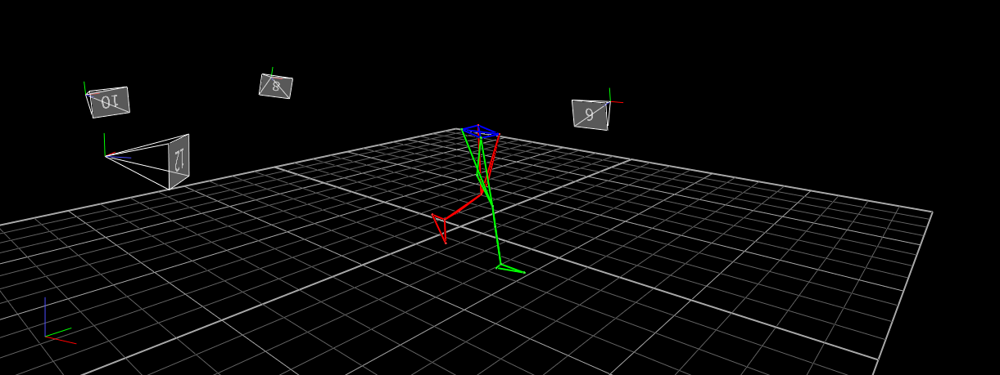
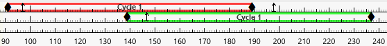

# Gait Analysis Software

---

### Requirements
- **Operating System**: Windows 7 or higher
- **Python Version**: 3.8 or later
- **Vicon Nexus**: Version 2.14 (older versions are not tested)

---

### How to Use
To run this program, follow these steps:

### Step 1: Prepare Vicon Nexus
1. Open **Vicon Nexus 2.14**.
2. Load a skeleton to ensure the system is ready for analysis.  
   The skeleton must include the following markers:
   - `'LTHI'`, `'LKNE'`, `'LTIB'`, `'LANK'`, `'LHEE'`, `'LTOE'`, `'LASI'`, `'LPSI'`
   - `'RTHI'`, `'RKNE'`, `'RTIB'`, `'RANK'`, `'RHEE'`, `'RTOE'`, `'RASI'`, `'RPSI'`

   Example of a skeleton in Vicon Nexus:
   

3. Ensure the following events are properly added to the tracks:
   - **Foot Strike**: When the left foot touches the ground, add a `Foot Strike` event to the **left track**.
   - **Foot Off**: When the right foot lifts off the ground, add a `Foot Off` event to the **left track**.
   - Repeat the process:
     - Add `Foot Strike` again when the right foot touches the ground.
     - Add `Foot Off` when the left foot lifts off the ground.

   Ensure these events are added correctly to generate accurate gait reports.
   Example of how the events should look:
   

---

### Step 2: Install Required Modules
1. Ensure you have a virtual environment set up for the project. If not, create one:
   ```bash
   python -m venv .venv
   ```
2. Activate the virtual environment:
   - On Windows:
     ```bash
     .venv\Scripts\activate
     ```
   - On Linux/Mac:
     ```bash
     source .venv/bin/activate
     ```
3. Install the required modules listed in `requirements.txt`:
   ```bash
   pip install -r requirements.txt
   ```

### Step 3: Install `viconnexusapi` Module
The Nexus API is supplied as a Python package called `viconnexusapi` and is installed automatically with Nexus. However, since Nexus uses Python 2, you need to manually move the module to the Python 3 environment.

1. Locate the `viconnexusapi` module:
   - Default location:  
     `C:\Program Files (x86)\Vicon\Nexus2.14\SDK\Win32\Python`

2. Copy the `viconnexusapi` folder and move it to your virtual environment:
   - Destination:  
     `.venv/Lib/site-packages/`

This ensures that the Nexus API can run in the Python 3 environment required by this program.

---

### Step 3: Configure Paths
Make sure the following paths in the `run_LL.py` script are correctly set and up to date:
   - **`venv_path`**: Path to the virtual environment.
   - **`script_path`**: Path to the main script to execute.
   - **`project_dir`**: Path to the project directory.

---

### Step 4: Run the Program
Execute the `run_LL.py` file:
```bash
python run_LL.py
```
---

### Step 5: Using the Interface
The interface for this program is in **Romanian**. Follow these steps to configure the interface:

1. **Set the Reference File (**`Fișierul cu unghiurile etalon`**):**
   - Use the interface to select the file containing the reference angles. This file will be used as a baseline for comparison.

2. **Set the Export Folder (**`Director pentru salvare`**):**
   - Specify the folder where the analysis results will be saved.

3. **Run the Analysis (**`Generează raportul`**):**
   - Once the reference file and export folder are set, start the analysis. Results will be saved in the specified export folder.

   Example results can be found in the **`exports/`** folder of this repository.

---

## License
This project is licensed under the MIT License. See the [LICENSE](LICENSE) file for more details.

---

## Contact
For questions or support, please contact [Ghimciuc Ioan](mailto:ghimciucioan.bw@gmail.com).
```
